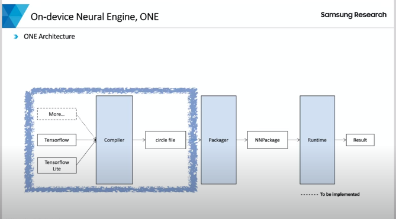
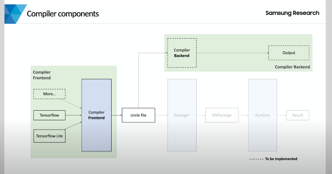
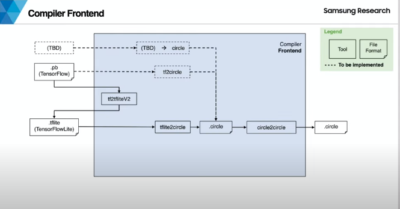
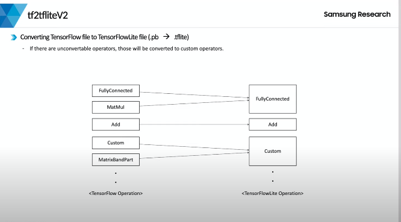
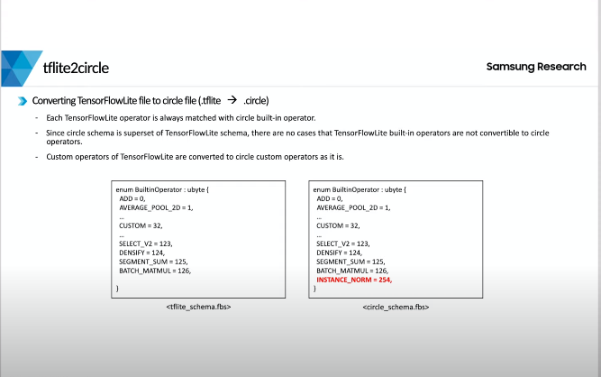

# ONE 

## On device AI ? 

- AI는 더이상 낯선 분야가 아니다. 알파고가 세상에 나온지 4년이 지났고, 그동안 새로운 인공지능들이 많이 생겨났다.
- 기존 AI는 대부분 클라우드나 서버처럼 강력한 컴퓨팅 파워를 이용해 AI 모델을 실행했다.
- 하지만, 시간이 지나면서 점점 문제점들이 발생했다. 
    - 서버의 개인정보를 저장하게 되어 개인정보 보호에 민감
    - 클라우드를 거치게 되니 반응속도 느려짐
    - 인터넷이 끊기면 AI 모델을 실행시킬 수 없음

- 사람들은 이 문제에 대한 해답을 디바이스에서 찾기 시작한다. 
    - 디바이스에서 AI를 수행하면, 개인정보를 저장할 필요가 없고, 클라우드를 거치지 않으니 반응속도도 빨라지고, 인터넷이 끊겨도 저전력과 저비용으로 AI 모델을 실행시킬 수 있기 때문 ! 

- 그렇기 때문에, 더이상 클라우드 기반 AI가 아닌 On device AI가 각광받고 있다.

### ON-device AI의 전제조건 

- 디바이스 성능이 클라우드나 서버의 컴퓨팅 파워를 따라가지 못하기 때문에, 기존의 거대했던 모델을 디바이스에서도 무리없이 돌릴 수 있도록 작고 가볍게 만들어야한다.
- 프로세서의 종류도 다양하기 때문에, 각 특성에 맞게 AI모델이 잘 동작하게 해야함
- 디바이스에서 모델을 빠르게 동작할 수 있도록 각 하드웨어 프로세서에 맞는 최적화를 구현해줄 수 있다.

## ONE 프로젝트의 배경 

- compiler는 다양한 딥러닝 프레임워크로 만들어진 AI모델을 ONE이 자체적으로 정의한  작고 가벼운 circle 형식으로 변환해준다.
- compiler가 이 역할을 해주지 않으면, 런타임은 tensorflow나 tensorflow Lite 뿐만 아니라, 우닉스와 같은 새로운 딥러닝 인터페이스를 전부 관리해야하는 어려움이 생긴다. 
- ONE이 정의한 형식으로 통일 후 런타임에 전달하면, 런타임은 모델을 돌리는데에만 집중할 수 있다.
- 그럼 Circle을 바로 Runtime으로 전달하면 되는데, 왜 Packager가 필요한가? 
    - ONE이 자체적으로 정의한 Cirle이라고 해도, 새로운 작업들을 추가하며, Circle의 버전이 올라갈 수도 있고, 파일에 대한 다른 정보를 필요로 할 수도 있다.
    - 따라서, Packager라는 Circlefile에 부가정보를 추가해 NM 패키지라는 형태의 표준화된 형태로 런타임에 전달한다.
    - 런타임은 이 표준화된 NM 패키지와 모델에 input으로 사용될 data를 받아와, 각 하드웨어 프로세서에 맞게 빠르게 돌릴 수 있다. 
        - data: Image, 음성 등 

- Circle file을 런타임에서 수행하는 목적 외에, 특정 디바이스에서 사용될 수 있는 코드를 생성할 수 있지 않을까?

    - Compiler를 Circle file을 생성하는 Compiler FE와 생성된 Circle File을 이용해 다른 목적의 output을 생성하는 Compiler BE로 구분하여 현재의 ONE의 구조가 탄생했다.

    - 결국 ONE은 다양한 딥러닝 프레임워크로 만들어진 NN 모델을 사용자 기기에 맞게 소형화, 최적화하는 컴파일러와, 소형화된 모델을 최적화하는 패키저, 표준화된 모델을 사용자 단말에서 실행하기 위한 런타임 모두를 포함하는 On Device AI를 제공하고자한다. 

## Compiler

- Compiler FE는 Circle파일 생성 , Compiler BE는 생성된 circlefile을 다른 디바이스에서 사용하게 도움 
    - 현재는 Compiler FE를 집중 개발하고 있다. 

#### Compiler FE는 어떻게 Circlefile을 생성하는가? 

##### Circle ?

- AI 모델을 표현하는 언어 

- 런타임과 컴파일러는 AI 모델을 주고 받을 때 Circle로 의사소통을 한다. 

    - 이 때, Circle 규칙은 Circle schema이다. 

    - Circle = 한글, Circle Schema = 한글의 규칙 

- Circle Schema를 정의하고 flexty라는 툴을 사용해 헤더를 만들게 되면, 런타임과 컴파일러가 헤더를 참고하여 써클로 작성된 모델을 서로 주고 받는 것이다. 

- Circle file을 생성한다 == Circle file로 작성된 AI 모델을 생성한다. 

#### Compiler FE

- compiler FE는 tensorflow나 tflite와 같은 딥러닝 프레임 워크를 받아들이면서 서클을 생성

    - 내부는 여러개의 모듈이 맞물려 Circle을 생성함 
    - Tensorflow file인 pb file은  tf2tfliteV2라는 모듈을 통해 ts lite로 변환됨 
    - tslite file은 tflite2circle을 통해 circle을 변환됨 

    - tesonflow는 tft2litecircle이라는 모듈이 개발되었기 때문에, 당장은 tf2tflite V2라는 module을 이용해서 tflite로 바꾸고, 다시 circle로 변환해주는 형식으로 지원하고 있지만, tf2tflite V2에서는 tensorflow가 제공하는 컨버터를 사용하고 있기 때문에, 이 의존성을 끊기 위해 궁극적으로 tf2 circle을 개발해서 지원할 예정이다. 

    - 나중에 새로운 딥러닝 프레임워크를 지원해야 한다면, 같은 이유로 circle로 direct 변환해주는 module을 개발해야 할 것이다. 

- 현재는 이런 방식으로 Circle을 생성하고 있지만, NN 패키지로 변환되기 전에 Circle to Circle이라는 모듈을 한 번 더 거치게 된다. 

##### Circle2Circle

- 앞선 과정에서 생성된 Circle model의 최적화를 해주거나 아니면 추가 변환 작업을 위해 사용되는 모듈인데, 뒤에서 다시 자세히 설명

-  순수한 Circle file을 받아서 추가 작업이 이루어진 Circle file을 생성해주는 모듈임 

**정리**

- Compiler FE는 일차적으로 Circle을 생성한 후 그 생성된 Circle을 최적화나 다른 작업들을 추가적으로 수행 후 다음 Packager에게 전달한다. 

### tf2tfliteV2

#### Converting TensorFlow file to TensorFlowLite file (.pb -> .tflite)

- If there are unconvertable operators, thoes will be converted to custom operators.

- Tensorflow file을 tensorFlow Lite file로 변환 

- If 나 While과 같은 Control Flow Operation을 변환해주고 변환되지 않는 Operation들은 Custom Operation이라는 특수한 Operation으로라도 변환 해준다. 
- 내부적으로는 Tensorflow에서 공식적으로 제공하는 tflite convertor의 python api를 사용하기 때문에, python으로 작성된 script라서 python에 익숙한 사람들은 보기 편할 수 있다. 
- **tf2tflitev2는 tensorflow convertor를 이용해서,  pb ifle을 tf2tfliteV2로 변환하는데, 변환이 불가능한 operation은  custom operation으로 변환한다 !** 

#### Converting TensorFlowLite file te Cricle file (.tflite -> .circle)

- Each TensorFlowLite operator is always matched with circle built-in operator
    - 각 TensorFlowLite operator는 항상 circle built-in operator와 일치합니다.
- Since circle schema is supperset of TensorFlowLite schema, ther are no cases that TensorFlowLite built-in operators are not convertible to circle operators 
    - circle schema는 TensorFlowLite schema의 상위 집합이므로 TensorFlowLite built-in operator를 circle operator로 변환할 수 없는 경우가 없습니다.
- Custom operators of TensorFlowLite are converted to circle custom operators as it is .
    - TensorFlowLite의 Custom operator는 그대로 Circle custom operators로 변환된다. 

- 그림의 왼쪽이 tensorflowlite schema이고, 오른쪽이 Circle schema이다. 
- 상당히 비슷하고, 실제로 Circle schema는 tflite를 확장해 만든것으로, 이 tf라이트에 더해서 ONE이 자체적으로 더표한혀고 싶었던 것을 추가했다고 보면 됨 
- 따라서, 필요한 구현만 되어있다면 tflite의 모든 operation을 변환할 수 있고 tflite에서 특수하게 표현된 custom operation까지 그대로 잘 변환된다. 

**정리**

- tflite2circle은 tflite를 circle로 대부분 잘 변환해준다. 

