[toc]

# ONE 

https://www.youtube.com/watch?v=QfQ3aM7HpJo

## On device AI ? 

- AI는 더이상 낯선 분야가 아니다. 알파고가 세상에 나온지 4년이 지났고, 그동안 새로운 인공지능들이 많이 생겨났다.
- 기존 AI는 대부분 클라우드나 서버처럼 강력한 컴퓨팅 파워를 이용해 AI 모델을 실행했다.
- 하지만, 시간이 지나면서 점점 문제점들이 발생했다. 
    - 서버의 개인정보를 저장하게 되어 개인정보 보호에 민감
    - 클라우드를 거치게 되니 반응속도 느려짐
    - 인터넷이 끊기면 AI 모델을 실행시킬 수 없음

- 사람들은 이 문제에 대한 해답을 디바이스에서 찾기 시작한다. 
    - 디바이스에서 AI를 수행하면, 개인정보를 저장할 필요가 없고, 클라우드를 거치지 않으니 반응속도도 빨라지고, 인터넷이 끊겨도 저전력과 저비용으로 AI 모델을 실행시킬 수 있기 때문 ! 

- 그렇기 때문에, 더이상 클라우드 기반 AI가 아닌 On device AI가 각광받고 있다.

### ON-device AI의 전제조건 

- 디바이스 성능이 클라우드나 서버의 컴퓨팅 파워를 따라가지 못하기 때문에, 기존의 거대했던 모델을 디바이스에서도 무리없이 돌릴 수 있도록 작고 가볍게 만들어야한다.
- 프로세서의 종류도 다양하기 때문에, 각 특성에 맞게 AI모델이 잘 동작하게 해야함
- 디바이스에서 모델을 빠르게 동작할 수 있도록 각 하드웨어 프로세서에 맞는 최적화를 구현해줄 수 있다.

## ONE 프로젝트의 배경 

- compiler는 다양한 딥러닝 프레임워크로 만들어진 AI모델을 ONE이 자체적으로 정의한  작고 가벼운 circle 형식으로 변환해준다.
- compiler가 이 역할을 해주지 않으면, 런타임은 tensorflow나 tensorflow Lite 뿐만 아니라, 우닉스와 같은 새로운 딥러닝 인터페이스를 전부 관리해야하는 어려움이 생긴다. 
- ONE이 정의한 형식으로 통일 후 런타임에 전달하면, 런타임은 모델을 돌리는데에만 집중할 수 있다.
- 그럼 Circle을 바로 Runtime으로 전달하면 되는데, 왜 Packager가 필요한가? 
    - ONE이 자체적으로 정의한 Cirle이라고 해도, 새로운 작업들을 추가하며, Circle의 버전이 올라갈 수도 있고, 파일에 대한 다른 정보를 필요로 할 수도 있다.
    - 따라서, Packager라는 Circlefile에 부가정보를 추가해 NM 패키지라는 형태의 표준화된 형태로 런타임에 전달한다.
    - 런타임은 이 표준화된 NM 패키지와 모델에 input으로 사용될 data를 받아와, 각 하드웨어 프로세서에 맞게 빠르게 돌릴 수 있다. 
        - data: Image, 음성 등 

- Circle file을 런타임에서 수행하는 목적 외에, 특정 디바이스에서 사용될 수 있는 코드를 생성할 수 있지 않을까?

    - Compiler를 Circle file을 생성하는 Compiler FE와 생성된 Circle File을 이용해 다른 목적의 output을 생성하는 Compiler BE로 구분하여 현재의 ONE의 구조가 탄생했다.

    - 결국 ONE은 다양한 딥러닝 프레임워크로 만들어진 NN 모델을 사용자 기기에 맞게 소형화, 최적화하는 컴파일러와, 소형화된 모델을 최적화하는 패키저, 표준화된 모델을 사용자 단말에서 실행하기 위한 런타임 모두를 포함하는 On Device AI를 제공하고자한다. 

## Compiler

- Compiler FE는 Circle파일 생성 , Compiler BE는 생성된 circlefile을 다른 디바이스에서 사용하게 도움 
    - 현재는 Compiler FE를 집중 개발하고 있다. 

#### Compiler FE는 어떻게 Circlefile을 생성하는가? 

##### Circle ?

- AI 모델을 표현하는 언어 

- 런타임과 컴파일러는 AI 모델을 주고 받을 때 Circle로 의사소통을 한다. 

    - 이 때, Circle 규칙은 Circle schema이다. 

    - Circle = 한글, Circle Schema = 한글의 규칙 

- Circle Schema를 정의하고 flexty라는 툴을 사용해 헤더를 만들게 되면, 런타임과 컴파일러가 헤더를 참고하여 써클로 작성된 모델을 서로 주고 받는 것이다. 

- Circle file을 생성한다 == Circle file로 작성된 AI 모델을 생성한다. 

#### Compiler FE

- compiler FE는 tensorflow나 tflite와 같은 딥러닝 프레임 워크를 받아들이면서 서클을 생성

    - 내부는 여러개의 모듈이 맞물려 Circle을 생성함 
    - Tensorflow file인 pb file은  tf2tfliteV2라는 모듈을 통해 ts lite로 변환됨 
    - tslite file은 tflite2circle을 통해 circle을 변환됨 

    - tesonflow는 tft2litecircle이라는 모듈이 개발되었기 때문에, 당장은 tf2tflite V2라는 module을 이용해서 tflite로 바꾸고, 다시 circle로 변환해주는 형식으로 지원하고 있지만, tf2tflite V2에서는 tensorflow가 제공하는 컨버터를 사용하고 있기 때문에, 이 의존성을 끊기 위해 궁극적으로 tf2 circle을 개발해서 지원할 예정이다. 

    - 나중에 새로운 딥러닝 프레임워크를 지원해야 한다면, 같은 이유로 circle로 direct 변환해주는 module을 개발해야 할 것이다. 

- 현재는 이런 방식으로 Circle을 생성하고 있지만, NN 패키지로 변환되기 전에 Circle to Circle이라는 모듈을 한 번 더 거치게 된다. 

##### Circle2Circle

- 앞선 과정에서 생성된 Circle model의 최적화를 해주거나 아니면 추가 변환 작업을 위해 사용되는 모듈인데, 뒤에서 다시 자세히 설명

-  순수한 Circle file을 받아서 추가 작업이 이루어진 Circle file을 생성해주는 모듈임 

**정리**

- Compiler FE는 일차적으로 Circle을 생성한 후 그 생성된 Circle을 최적화나 다른 작업들을 추가적으로 수행 후 다음 Packager에게 전달한다. 

### tf2tfliteV2

#### Converting TensorFlow file to TensorFlowLite file (.pb -> .tflite)

- If there are unconvertable operators, thoes will be converted to custom operators.

- Tensorflow file을 tensorFlow Lite file로 변환 

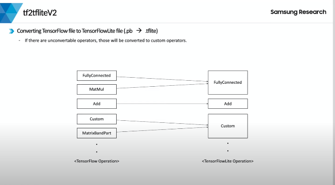

- If 나 While과 같은 Control Flow Operation을 변환해주고 변환되지 않는 Operation들은 Custom Operation이라는 특수한 Operation으로라도 변환 해준다. 
- 내부적으로는 Tensorflow에서 공식적으로 제공하는 tflite convertor의 python api를 사용하기 때문에, python으로 작성된 script라서 python에 익숙한 사람들은 보기 편할 수 있다. 
- **tf2tflitev2는 tensorflow convertor를 이용해서,  pb ifle을 tf2tfliteV2로 변환하는데, 변환이 불가능한 operation은  custom operation으로 변환한다 !** 

#### Converting TensorFlowLite file te Cricle file (.tflite -> .circle)

- Each TensorFlowLite operator is always matched with circle built-in operator
    - 각 TensorFlowLite operator는 항상 circle built-in operator와 일치합니다.
- Since circle schema is supperset of TensorFlowLite schema, ther are no cases that TensorFlowLite built-in operators are not convertible to circle operators 
    - circle schema는 TensorFlowLite schema의 상위 집합이므로 TensorFlowLite built-in operator를 circle operator로 변환할 수 없는 경우가 없습니다.
- Custom operators of TensorFlowLite are converted to circle custom operators as it is .
    - TensorFlowLite의 Custom operator는 그대로 Circle custom operators로 변환된다. 

- 그림의 왼쪽이 tensorflowlite schema이고, 오른쪽이 Circle schema이다. 
- 상당히 비슷하고, 실제로 Circle schema는 tflite를 확장해 만든것으로, 이 tf라이트에 더해서 ONE이 자체적으로 더 표현하고 싶었던 것을 추가했다고 보면 됨 
- 따라서, 필요한 구현만 되어있다면 tflite의 모든 operation을 변환할 수 있고 tflite에서 특수하게 표현되었던 custom operation까지 그대로 잘 변환된다. 

**정리**

- tflite2circle은 tflite를 circle로 대부분 잘 변환해준다. 

### Circle2Circle

#### Transforming/Optimizing Circle file

- After circle is generated, dependency for deep learning framework is removed
    - circle이 생성되면 deep learning framework의 의존성이 제거된다.
        - 다른 딥러닝 프레임워크의 모델이 circle로 변환되었기 때문 
- Then, input and output of transforming or optimizing circle file is circle.
    - 그러면, 변환 또는 최적화된 circle file의 입력과 출력은 circle이 된다. 
- It means that we can use a structure which is similar with pss of LLVm. this structure enable developing variety of circel tools like lego block
    - 이는 LLVM의 pss와 유사한 구조를 사용할 수 있다는 의미이다. 해당 구조는 레고 블럭과 같은 다양한 서클 도구를 개발할 수 있다. 

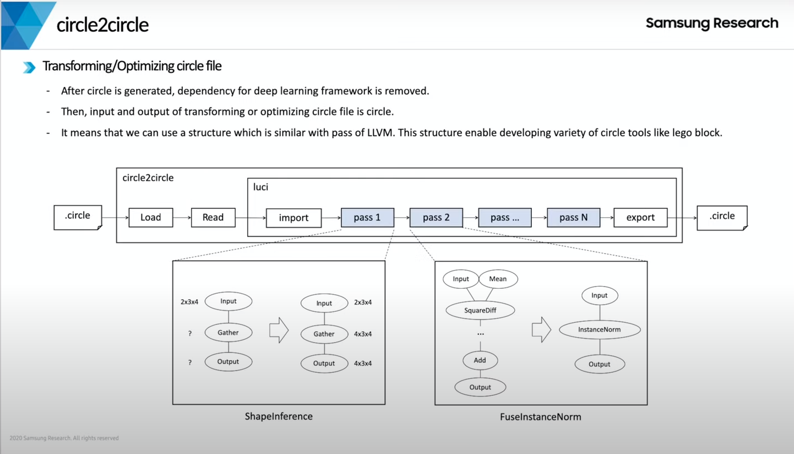

- 해당 과정에서 circle로 변환된 이후에 circle만의 최적화를 자체적으로 구현할 수 있고, 그림에서 처럼 기존 operation들을 뭉쳐서 ONE이 정의한 instance Norm이라는 operation으로 변환 해, 런타임에서 좀 더 빠른 AI 모델을 돌릴 수 있게 해줄 수 있다.
- 이런 작업들의 하나 하나 단위를 Pass라고 부르는데, 이 pass들의 특징은 입력과 출력이 모두 circle로 고정되어 있다는 것이다.
- 이 특징이 어떤 장점을 가져다 줄 수 있을까?
    - 레고와 유사하다. 레고는 꽂히는 부분과 끼우는 부분만 만들어 놓는다면 어떤 모양의 블록이 있던간, 원하는 대로 조합을 해서 다양한 작품을 만들 수 있다. 
    - pass들도 마찬가지다. 입출력이 circle로 고정되어 있고, 최적화나 변환 작업의 구현만 이루어진다면, 다양한 용더의 circle 전용 tool을 개발할 수 있다.
    - 그래서, 이 패스들은 레고블럭을 모아놓은 것처럼 모두 Luci 안에 모여 있기 때문에, **Luci 안에 최적화나 서비스를 언제든지 가져다가 조합해서 새로운 툴을 개발할 수도 있고, 아니면 새로운 pass를 구현해서 기능을 추가할 수 잇다.**

**정리**

- circle2circle은 Luci에 있는 다양한 pass를 조합해서 추가적인 최적화나 다른 작업들을 해준다. 

#### Luci-value-test

- 지금까지 pb파일을 input으로 받아서 tflite를 거치고, 다시 circle을 생성 한 후 여러 circle pass를 적용하는 것을 확인했다. 

- 그렇다면, tflite to circle을 통해 생성된 파일이 정말 잘 변환되었다고 믿을 수 있을까? 

-  누구나 납득하기 위해서는 객관적인 검증이 필요하다. 

- 그러한 이유로 만들어진 테스트 모듈이 luci-value-test이다.

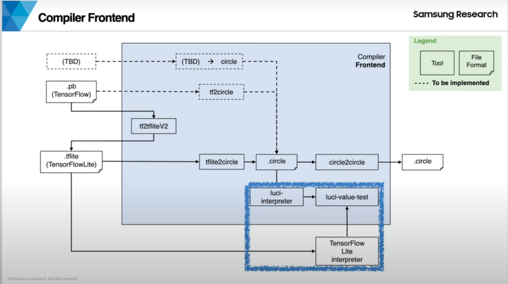

- tflite가 circle로 올바르게 변환되었는지 검증할 수 있는 가장 직관적인 방법은 tflite 파일을 실행했을 때 결과와, circlefile을 수행했을 때 결과를 비교하는 것이다.
- **luci-value-test가 바로 이 작업을 수행하고 있다.**
    - tflite 파일은 tflite interpreter로 수행하고, circlefile은 luci-interpreter로 수행을 해서, 두 결과를 비교하는 작업이 바로 luci-value test에 들어있는 것이다.
- 어덯게 circlefile이 interpreter에서 수행되고 어떻게 비교되는지 궁금하다면, luci-interpreter와 luci-value-test를 git repository에서 찾아보면 된다. 

**정리**

- complier의 input들은 각각 모듈을 통해 circle file로 변환한다. 
- 만약 새로운 deep learning framework를 지원하게 된다면, circle로 변환하는 모듈만 추가하면 된다.
- 이렇게 생성된 circle은 luci-value-test를 통해 검증되고 있고, 그렇다고 circle은 바로 패키저로 전달되는 것은 아니다.
- circle2circle에서 luci에 여러 pass들을 통해서 필요한 작업들을 적용한 후에 패키저로 전달된다. 

**다양한 딥러닝 프레임워크의 모델 파일을 받아서 런타임이 돌릴 수 있는 circle을 잘 생성해준다. **

## Runtime

- 다양한 tool에서 나오는 output을 컴파일러 FE에서 Circle로 내보내면, Packeger에서 NNPackage로 바꾸어주고, 이를 Runtime에서 Input으로 사용하게 된다.
- 이 모델을 inference해서, 결과값을 내보내는 역할을 하는 것이 Runtime이다.

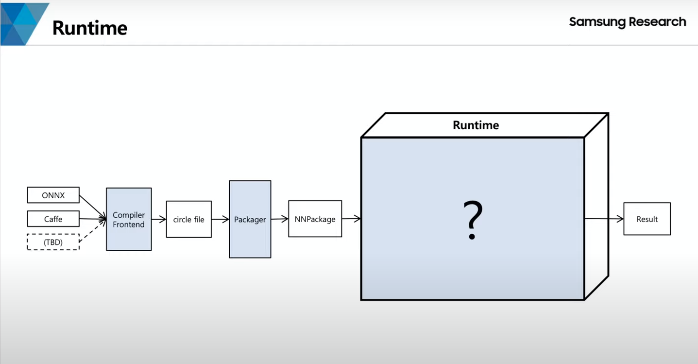

#### runtime의 특징 

- Designed for edge devices
    - 엣지 디바이스를 타겟으로 설계

- Supports backends as plugins
    - 백엔드를 플러그인으로 사용함 
    - Users can implement backends with Backend API
        - 사용자가 백엔드 API를 사용하여 백엔드 구현 가능 

- Supports simultaneous run with heterogeneous backends
    - 서로 다른 백엔드를 동시 실행 지원 
    - Multiple backends can be used in a model
        - 하나의 모델을 추론(inference)하기 위해서 여러 백엔드 사용 가능 

- Supported Formats(지원되는 형식 )

    - NNPackages

        - CIRCLE(.circle), ONE

        - Tensorflow Lite(.tflite, Tensorflow

    - NNAPI(Neural Networks API), Android

### Layered Architecture

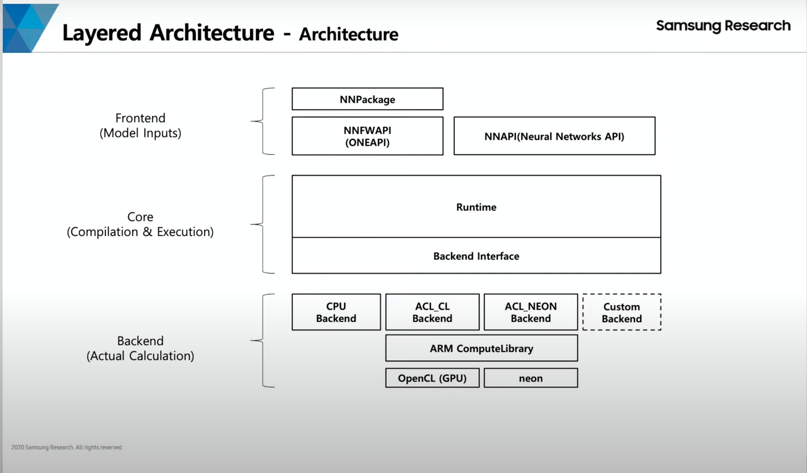

- FE는 Compiler에서 만들어준 NN 패키지를 input으로 받을 수 있는 NNFWAPI가 있고, 별도로 안드로이드의 NNAPI 또한 지원한다.
- Core는 Runtime과 Backend API로 구성되어 있는데, 백엔드 인터페이스는 백엔드를 별도의 플러그인 방식으로 지원하기 위해 사용하는 구조
- 백엔드는 실제 연산을 지원하는 부분 
    - CPU, GPU, NPU 등 다양한 하드웨어를 이용해 컴퓨팅 연산을 할 수 있게 하는 다양한 알고리즘을 가지고 있는 거이 백엔드이다. 

- ONE은 기본적으로 3개의백엔드를 지원하지만, Backend Interface를 이용하여 유저가 custom하여 추가할 수 잇는 구조이다. 

#### Core

Core's each module corresponds to namespaces

- Core의 각 모듈은 네임스페이스에 해당
- onert::ir stands for Intermediate Representation
    - onert::ir는 중간 표현을 나타낸다.

- oneert::compiler compiles IR to execution. Some backends can be loaded and used for compliation.
    - oneert:: compiler는 IR을 실행으로 컴파일한다. 일부 백엔드를 로드하여 준수된 규정하에 사용할 수 있다.

- onert::exec is an execution module. It is the result of compliation.
    - onert::exec은 실행 모듈이다. 그것은 compliation의 결과이다.

- onert:: backend is an backend interface
    - 백엔드 인터페이스이다.

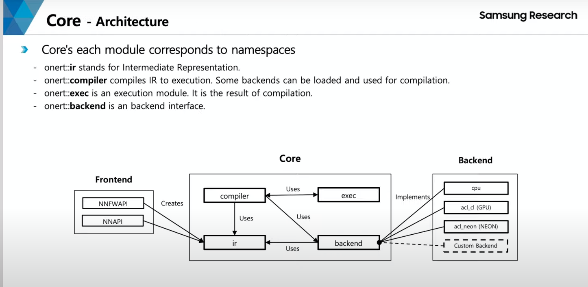

- core의 4모듈들과 FE,BE가 서로 화살표로 이어져 있는데, 이는 서로의 연결관계를 나타낸다. 
- ir을 확인하면, FE로부터 Creates 화살표가 연결되어 있는데, core에서는 FE의 각 api로부터 받은 모듈을 ir로 생성해서 중간 표현으로 이동한다.
- 그리고, core의 backend가 오른쪽 backend 레이어에 연결되어 있는데, core의 backend가 backend interface이고, 오른쪽 backend는 이를 구현하엿기 때문에, implements 화살표로 연결되어 있다. 

- core의 모듈간 의존관계를 살펴보면, compiler가 ir, Be, executor를 사용한다 compiler는 실제 모델의 inference 연산을 실행하기 전에 준비 작업을 하는 모델이다. 
- 그 바로 옆의 exec 모듈은 컴파일러를 사용하고 있다. 컴파일러에서 실행 준비가 다 된 모듈을 exec 모듈에서 실행한다. 

### Runtime 구조 

- Runtime 전체 실행 구조 

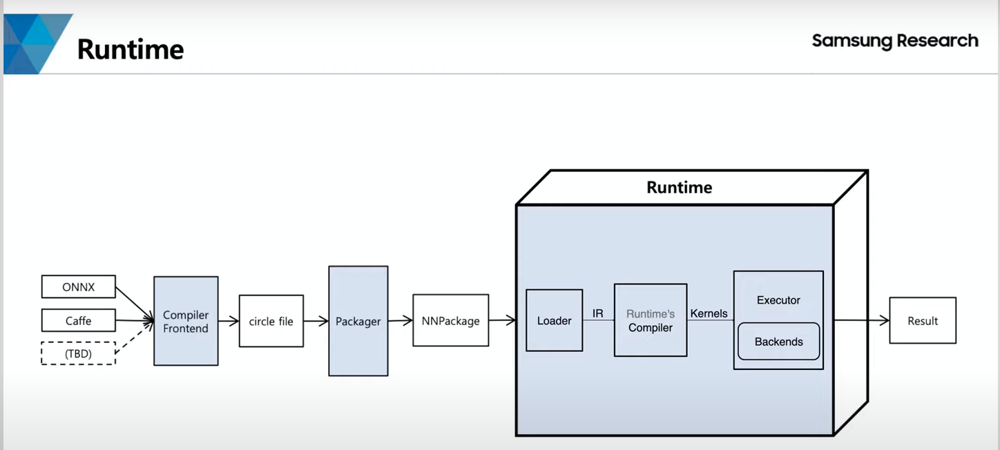

#### API - Overall Structure

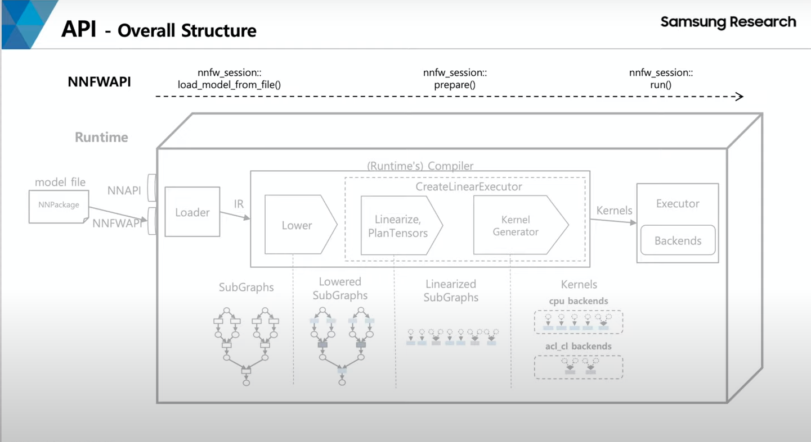

- load_model_from_file() : 파일을 읽는다.
- prepare() : 모델을 compile해서 준비한다.
- run() : 실제로 executor를 실행한다. 모델을 돌린다. 

**런타임의 처리 방식 ** 

1. FE에서 NN 패키지를 읽는다.

2. Loader에서 패키지를 받아서 런타임 내 표현형인 IR로 변환한다.

    - 아래 SubGraphs는 IR에 있는 데이터 구조 중 하나이다.

        - IR의 모델은 말 그대로 NN 모델 1개를 의미한다.

        - IR

            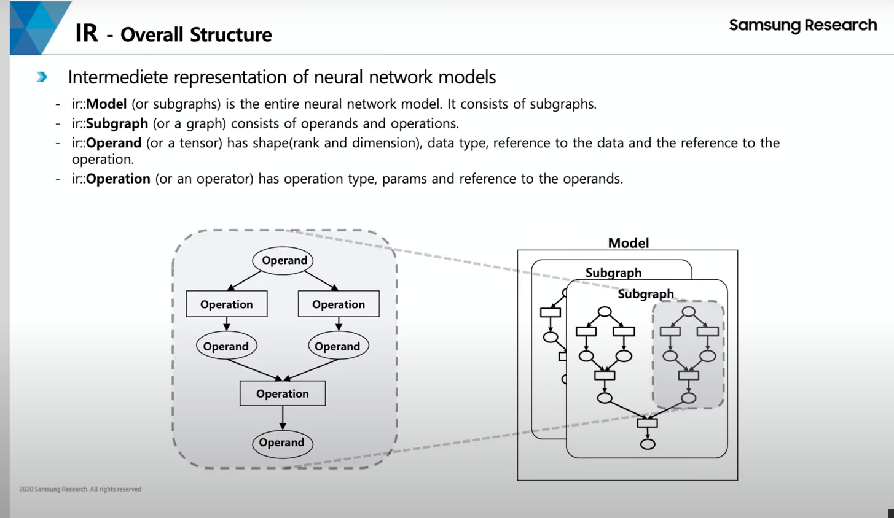

        -  runtime에서 nn 패키지를 읽으면 이 모델 하나를 읽게 되는데, 이 모델은 1개 혹은 여러개의 SubGraphs로 이루어져 있다.
        - SubGraphs는 왼쪽 그림과 같이 Operation과 Operend로 이루어져 있다. 
        - Operation과 Operand는 그림에서 각 네모와 동그라미로 표현되어 있다. 
            - Operand : Tensor로 Operation에 사용되는 데이터들을 가지고 있다.
            - Operation : add와 convolution과 같은 operation 1개 단위이고, parameter와 같은 정보를 같이 가지고 있다.

3. Loader에서 만들어진 SubGraph가 Compiler로 들어간다.

    - compiler는 ONE compiler가 아닌 Runtime에서 사용하는 Compiler이다. 
    - Runtime 중에서도 Model file을 execution하기 전 모델 compile 단계를 거치는데, 이름은 compiler지만, runtime 중에 실행되다 보니 헷갈릴 수 있지만, runtime 실행 환경 상황에 맞춰 실행방식과 연산 모듈을 변경할 수 있기 때문에, 그런 것이다.

4. Compiler에서는 Loader에서 건내준 IR을 받아 궁극적으로 Execute를 build한다.

5. 각 Operator별로 BE를 지정해주는데, 이것을 Lowering이라고 한다. 

    - Lowered Subgraph는 요소별로 색이 다른데, 다른 색은 다른 백엔드를 의미한다. Runtime에서는 이렇게 모델 하나를 돌리더라도, 2개 이상의 BE를 이용하는 것이 가능하다.

6. 아직 그래프인 것을 일렬로 정렬(Linearized)하는데, 이 때 dependency를 고려해야한다.

    - Operation의 선후 관계를 고려해서 순서를 결정하게 된다.
    - 이렇게 Operator를 Linearize하면 Tensor에 대한 메모리 사용계획을 잡을 수 있다.
    - Tensor들의 Lifetime이 결정되었으니, 이를 바탕으로 메모리 사용 계획을 잡는다.

7. Kernal Generator에서 백엔드 별로 Kernal을 만들어준다.

    - Kernal: Operator 하나와 계산 알고리즘을 포함하는 기능 
    - 추후 Executor에서 연산을 수행할 때, 그 실행 단위가 된다.

8. Executor는 커널들을 각기 할당된 백엔드를 이용하여 하나씩 실행해 주준다.

    - Executor 또한 compiler에서 build한다. 

### FE 

#### NNFWAPI(ONEAPI)- Frontend, Loader 

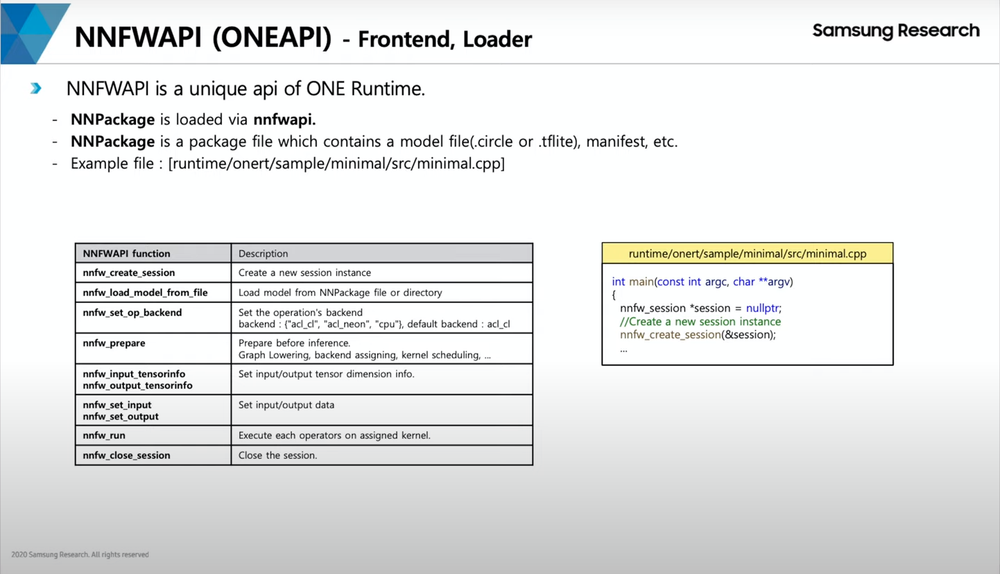

- 런타임에서 지원하는 API 중 NNFWAPI는 ONE Runtime이 지원하는 고유 API이다. 
- NNFWAPI의 Input은 NNPackage이다. 
    - NN패키지는 패키징된 모델 파일로, circle, tflite와 같은 modelfile과 manyfast와 같은 다른 정보들을 패키징 하고 있다. 

#### NNAPI

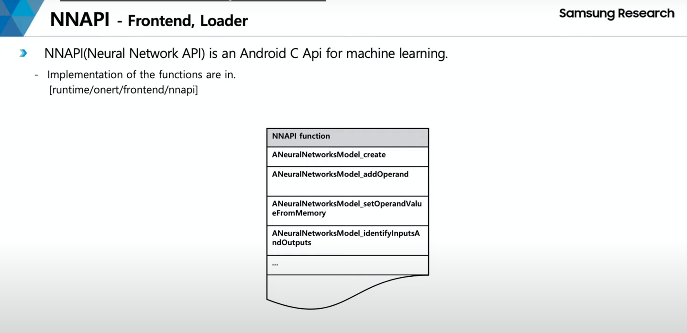

- NN API는 안드로이드 ndk에서 ML을 위해 지원하는 Android C API이다. 
- Runtime은 안드로이드 NN과 100% 호환된다. 
- 이는, ONE이 NNFWAPI를 정의하기 전에, 프로젝트 초기에 주로 사용했던 API이다. 

#### Loader

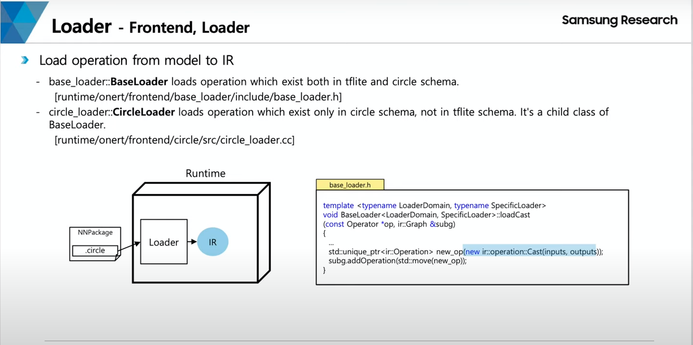

- base loader는 기본적으로 정의된 operator를 읽어드리는 역할이다.
- Circle loader의 operation은 Circle Schema에 고유하게 정의되어 있고, tflite schema에 없는 operator를 읽어들인다.
    - Circle loader는 BaseLoader를 상속받는다. 
- 이는, circle의 schema가 tflite에서 soak 한것이라 그 두개가 공통된 부분이 많기 때문에 이러한 구조를 띈다. 

### Compiler

#### Linearize 

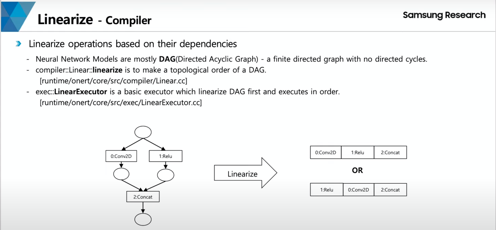

- Linearize는 그래프를 일렬로 ordering
- 그림에서는 convolution2d 그리고 Relu로부터 나온 output tensor가 concat의 input으로 들어간다.
- 이를 순서대로 실행하고 싶을 경우에, convolution2d와 Relu를 concat보다 먼저 실행하면 된다.
- 런타임의 주 excutor인 LinearExecutor에서는 이런식으로 Linearize 단계를 거친 후, Linear 순서를 미리 결정하고 operation을 실행한다.

#### Plantensor

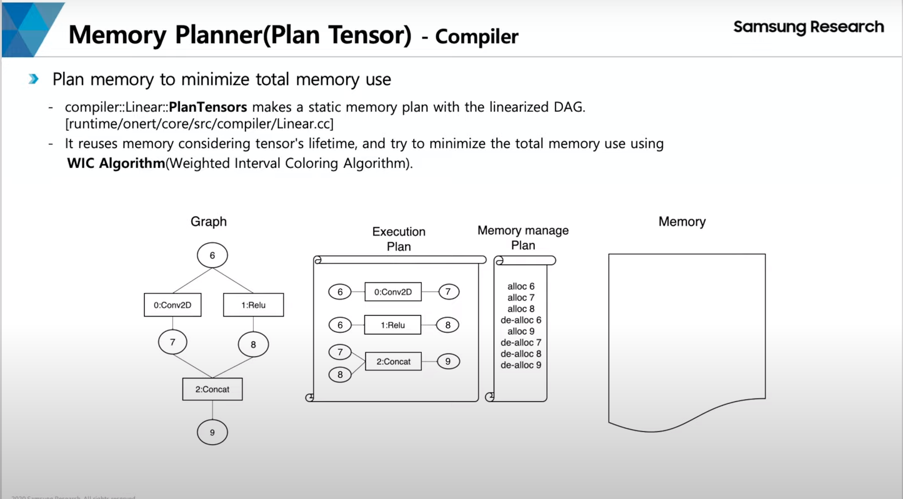

- 플랜탠서는 런타임의 메모리 플래너 
- tensor들의 실행 순서를 고려해, 메모리를 할당함 
- 최대한 적은 총 메모리를 사용하기 위해 현재는 WIC 알고리즘으로 메모리를 planing한다. 

- 예
    - 왼쪽 그림과 같은 그래프가 있을 때, 6번, 7번, 8번 순서로 tensor memory를 alloc한다. 그러면 0번과 1번 operation을 Operation을 실행하게 되고, 이가 종료되면 6번 Tensor는 필요 없으므로, de-alloc한다. 
    - 그 후, 9번 텐서 메모리로 alloc되는데, 이렇게 해제된 6번 자리에 텐서 9번이 allock되는 방식으로 서로 life span이 겹치지 않으며 같은 메모리 공간을 쓸 수 있다.
    - 2번 operation이 끝나면 7,8,9번 tensor를 deallock한다. 

#### Executor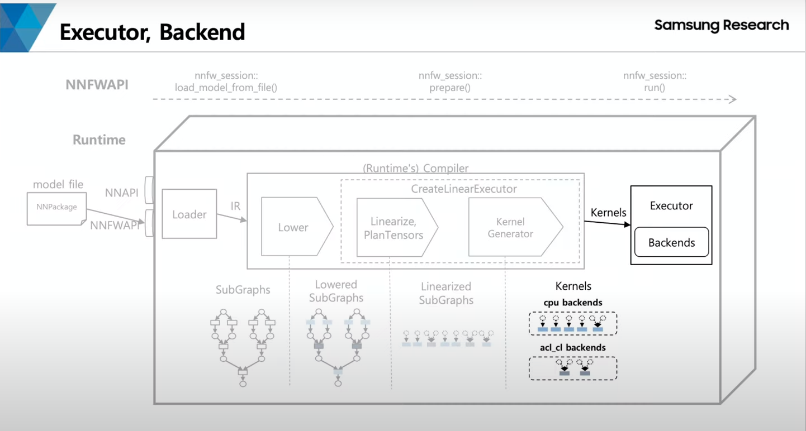

- compiler 내의 점선으로 Create LinearExecutor가 있는데, runtime에서는 3가지 executor를 지원한다. 
- 하지만, compiler에서 executor를 만드는 방식은 조금씩 다르다 .
- 이 중, Linearize를 수행하는 executor가 Linearexecutor로, 가장 기본적인 Executor이다. 

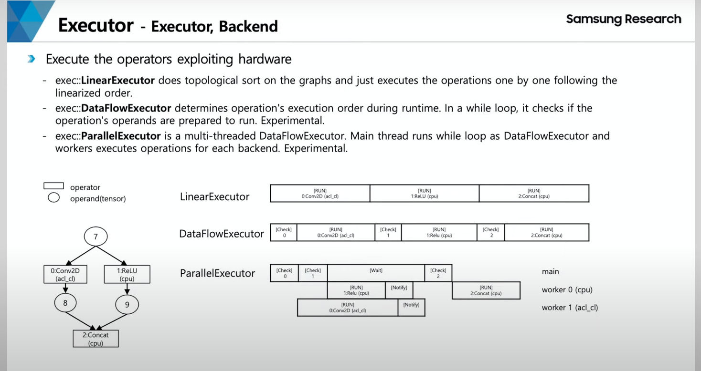

- LinearExecutor는 Linearize 후에, 결정된 순서대로 execution을 진행하는데, 이에 반해 DataFlowExecutor는 runtime중에 이 순서를 결정한다. While loop를 돌면서 각 Operation이 실행할 준비가 되었는지 체크하고, 준비되어있다면 이를 실행한다
- 만약 DataFlowFlowExecutor를 Multi thread로 실행시킨다면?
    - 아래 그림과 같이, cpu, gpu와 같은 하드웨어를 병렬적으로 사용할 수 있어, 더 빠르게 연산을 끝낼 수 있다.
    - 이가 ParallerExecutor이다.

- 그렇다면 ParallerExecutor가 더 좋아보이는데 왜 LinearExecutor를 기본 Executor로 사용할까? 
    - ParallerExecutor는 여러 BE를 동시에 실행할 수 있지만, 메모리 재사용이 제한적이다. 
    - 또한,  Multi thread에 대한 overhead도 있고, Runtime에서 실행 가능한지 operation을 실시간으로 탐색하는데 overhead도 있다.
    - 하지만, LinearExecutor는 동시 사용은 불가능 하지만, 메모리 재사용에 제약이 없고, operator 실행 순서를 미리 정해두었기 때문에, overhead가 별로 없다.

#### Backend

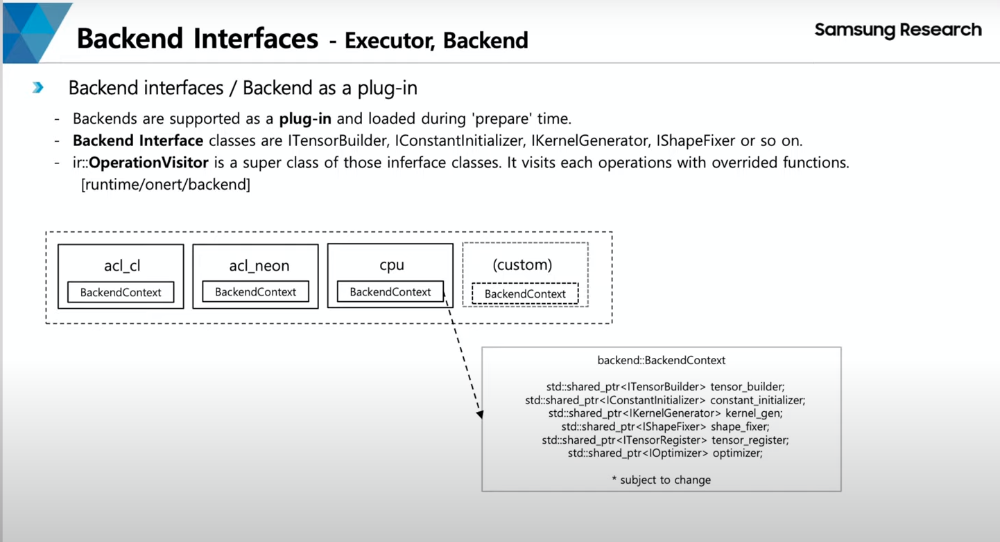

- 런타임 BE는 C++ 인터페이스 클래스들을 구현하여 만들 수 있다.
- 사용자가 연산장치와 라이브러리를 자유롭게 추가하게 하기 위해, BE interface를 정의하고, 구현과 분리해두었다.
- 인터페이스 클래스들은 대부분 OperationVistor class로부터 상속받는데, 이 클래스는 말그대로 operation을 visit하면서 operation에 대한 개별 작업을 수행한다.
- BEcontext를 보면 다음과 같이 인터페이스 클래스들의 구현체들의 포인터들을 가지고 있다.
- 이렇게 Interface class들을 구현해서, 백엔드별로 각기 다른 compile  정책들을 지원할 수 있다.

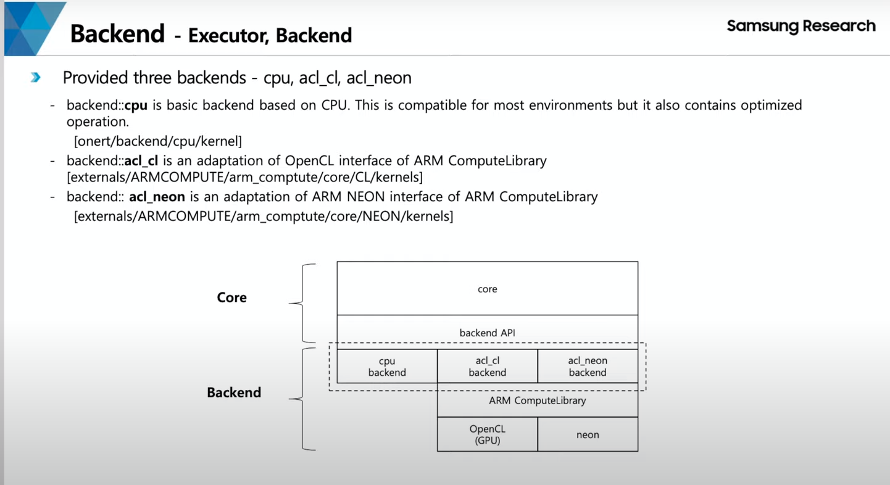

- executor에서 다양한 BE를 활용해 연산을 할 수 있는데, 현재 runtime에서 공식적으로 지원하는 BE는 cpu,acl_cl, acl_neon이다.
- cpu는 가장 기본적인 백엔드로 호환성이 가장 좋아 대부분의 환경에서 지원되고, 최적화된 연산도 지원한다.
- acl_cl과 acl_neon는 ARM ComputeLibrary를 사용하는 BE들이다.
- acl_cl은 open cl을 이용해 gpu를 사용하는 라이브러리이고, acl_neon은 CPU neon으로 연산 최적화를 지원하는 라이브러리이다. 

### 중점 개발 Feature

#### Control Flow(If,while)

- Models with control flow check subgraph's execution output and branch depending on the condition.
    - 제어 흐름이 있는 모델은 하위 그래프의 실행 출력 및 분기를 확인 

- 서브 그래프 단위로 if, while과 같은 분기를 수행하는 기능 

#### Dynamic Tensor(Shape Inference on-the-fly)

- Support inference on model with an input tensor with unknown shape.
    - 모델의 input tensor shape을 알지 못하더라도, runtime실행을 가능하게 해주고, 실행중에 tensor의 shape을 결정해서, 메모리를 할당하는 기능이다. model에 대한 추론 지원 
- 특히 음성 모델에서 Control Flow와 Dynamic Tensor를 필요로 하는 모델이 많아지는 트렌드를 반영해서 해당 기능등을 우선적으로 추가하고 있다. 

### 미션 소개 

#### 1. Compiler Mission

- Add a new operation
    - Overall structure is solid, but some operations are not implemented yet.
    - Add new operations to each module and make ONE support more operations!
- Add a new negative test case
    - Most of current test cases are positive. We need more negative test cases.
    - Add new negative test cases! 

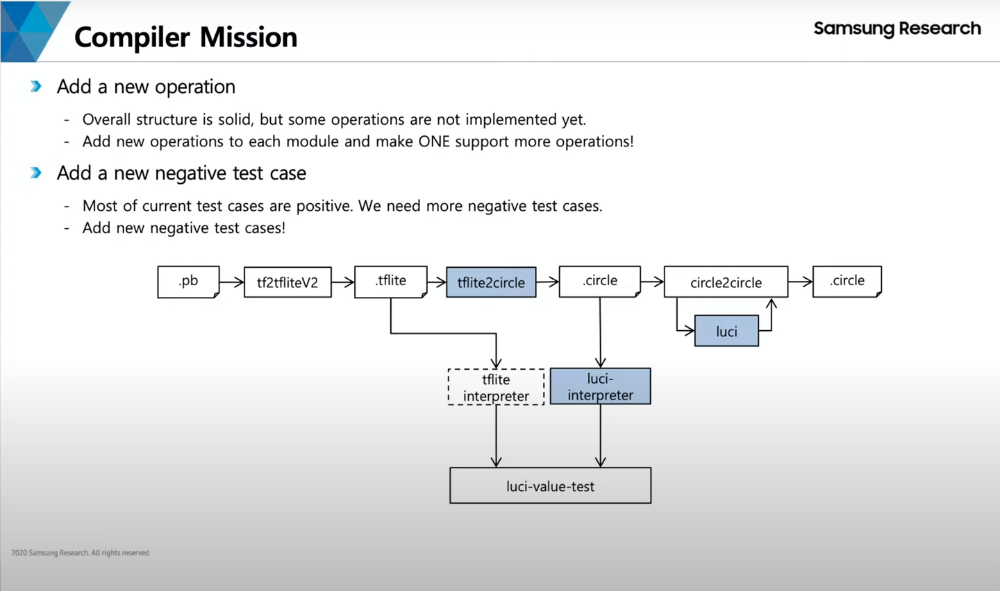

- 새로운 operation 추가하기
    - 전반적인 infra가 구축되어 있으나, 아직 지원되지 않는 operation이 남아있음
    - 각 모듈에 구현되지 않은 operation들을 찾아서 구현하면, compiler의 operation coverage를 높이는데 기여할 수 있음

- negative test case를 추가 
    - test를 하면 의도한대로 동작하는지 검증하지만, 의도한대로 동작하지 않으면 어떻게 되는지를 검증할 필요도 있다.

#### 2. Runtime Mission

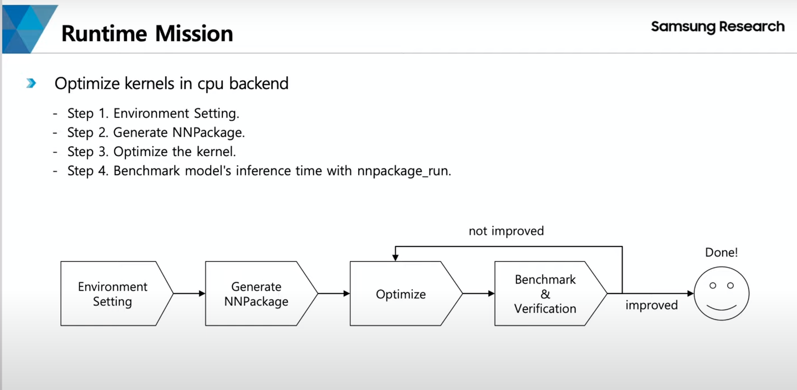

- CPU BE에 있는 Kernal 최적화 미션
- Kernal은 Operation의 알고리즘을 포함하는 하나의 실행단위이다. 해당 커널을 더 빠르게 수행하도록 최적하는 미션
- Runtime의 성능에 직결되는 미션 

#### 미션 확인

- good first issue 필터링으로 편하게 이슈를 찾을 수 있다. 

#### 삼성의 개발 방식

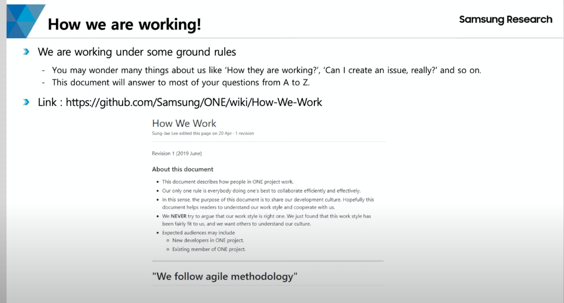
