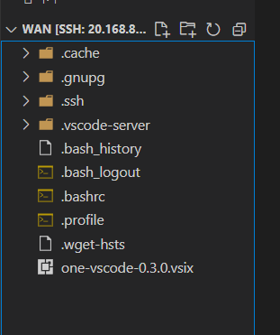

## onecc/one-build 실행 

https://github.com/Samsung/ONE/issues/7299

- 사전작업

    - one-compiler 

    ```
    $ git clone https://github.com/Samsung/ONE.git one
    $ cd one
    #configure 
    $ ./nncc configure
    #build 
    $ ./nncc build
    #unit test
    $ ./nncc test
    
    $ ./nnas create-package --prefix $HOME/.local
    
    
    ```

    - one-vscode

        - [one-vscode-0.3.0.vsix](https://github.com/Samsung/ONE-vscode/releases/download/0.3.0/one-vscode-0.3.0.vsix) 

            - 해당 파일 다운로드 

        - 원격 탐색기에서 로컬에 폴더 연결

            - 드롭다운 방식으로 다운받은 파일 옮기기기

            

        - 설치

            ```bash
            code --install-extension one-vscode-0.3.0.vsix
            ```


1. 가상환경 설치

    ```
    $ cd one/compiler/one-cmds/
    ~/one/compiler/one-cmds$ onecc
    ```

2. 가상환경 설치

    ```
    $ sudo apt-get update
    $ sudo apt-get upgrade
    $ sudo apt-get install python3.8 python3-pip python3.8-venv
    
    $ one-prepare-venv
    ```

    

3. onecc 실행

    ```
    onecc -v
    onecc version 1.21.0
    Copyright (c) 2020-2022 Samsung Electronics Co., Ltd. All Rights Reserved
    Licensed under the Apache License, Version 2.0
    https://github.com/Samsung/ONE
    ```


### one-build

#### pb to circle

https://github.com/Samsung/ONE/blob/a4ca4318c1f9331a102a7ab8c544794a108cffbf/docs/nncc/v1.0.0/tutorial.md

https://github.com/Samsung/ONE/blob/master/compiler/one-cmds/onecc.template.cfg

1. test data download

    ```
    $ wget https://storage.googleapis.com/download.tensorflow.org/models/tflite/model_zoo/upload_20180427/inception_v3_2018_04_27.tgz
    $ tar -xvf inception_v3_2018_04_27.tgz
    ```

2. create onebuild.template.cfg

    ```
    [one-build]
    one-import-tf=True
    one-import-tflite=False
    one-import-bcq=False
    one-import-onnx=False
    one-optimize=True
    one-quantize=False
    one-parition=False
    one-pack=True
    one-codegen=False
    
    [one-import-tf]
    input_path=inception_v3.pb
    output_path=inception_v3.circle
    input_arrays=input
    input_shapes=1,299,299,3
    output_arrays=InceptionV3/Predictions/Reshape_1
    converter_version=v1
    model_format=graph_def
    
    [one-optimize]
    input_path=inception_v3.circle
    output_path=inception_v3.opt.circle
    generate_profile_data=False
    
    [one-pack]
    input_path=inception_v3.opt.circle
    output_path=inception_v3_pack
    
    ```
    
3. 실행

    ```
    $ one-build -C onebuild.template.cfg 
    Estimated count of arithmetic ops: 11.460 G  ops, equivalently 5.730 G  MACs
    model2nnpkg.sh: Generating nnpackage inception_v3.opt in inception_v3_pack
    
    $ tree
    .
    ├── inception_v3.circle
    ├── inception_v3.circle.log
    ├── inception_v3.opt.circle
    ├── inception_v3.opt.circle.log
    ├── inception_v3.pb
    ├── inception_v3.tflite
    ├── inception_v3_2018_04_27.tgz
    ├── inception_v3_pack
    │   └── inception_v3.opt
    │       ├── inception_v3.opt.circle
    │       └── metadata
    │           └── MANIFEST
    ├── inception_v3_pack.log
    ├── labels.txt
    └── onebuild.template.cfg
    
    3 directories, 12 files
    ```
    
    

#### tflite to circle

1. test data download

    ```
    $ wget https://storage.googleapis.com/download.tensorflow.org/models/tflite/model_zoo/upload_20180427/inception_v3_2018_04_27.tgz
    $ tar -xvf inception_v3_2018_04_27.tgz
    ```

2. create one-buiild.template.cfg

    ```python
    [one-build]
    one-import-tf=False
    one-import-tflite=True
    one-import-bcq=False
    one-import-onnx=False
    one-optimize=True
    one-quantize=False
    one-parition=False
    one-pack=True
    one-codegen=False
    
    [one-import-tflite]
    # mandatory
    ; tflite file
    input_path=inception_v3.tflite
    ; circle file
    output_path=inception_v3.circle
    
    [one-optimize]
    input_path=inception_v3.circle
    output_path=inception_v3.opt.circle
    generate_profile_data=False
    
    [one-pack]
    input_path=inception_v3.opt.circle
    output_path=inception_v3_pack
    
    ```
    
3. 실행

    ```BASH
    $ one-build -C onebuild.template.cfg 
    model2nnpkg.sh: Generating nnpackage inception_v3.opt in inception_v3_pack
    
    $ tree
    .
    ├── inception_v3.circle
    ├── inception_v3.circle.log
    ├── inception_v3.opt.circle
    ├── inception_v3.opt.circle.log
    ├── inception_v3.pb
    ├── inception_v3.tflite
    ├── inception_v3_2018_04_27.tgz
    ├── inception_v3_pack
    │   └── inception_v3.opt
    │       ├── inception_v3.opt.circle
    │       └── metadata
    │           └── MANIFEST
    ├── inception_v3_pack.log
    ├── labels.txt
    └── onebuild.template.cfg
    
    3 directories, 12 files
    ```

    

### onecc

#### pb to circle 

1. test data download

    ```
    $ wget https://storage.googleapis.com/download.tensorflow.org/models/tflite/model_zoo/upload_20180427/inception_v3_2018_04_27.tgz
    $ tar -xvf inception_v3_2018_04_27.tgz
    ```

2. create onecc.template.cfg

    ```python
    [onecc]
    one-import-tf=True
    one-import-tflite=False
    one-import-bcq=False
    one-import-onnx=False
    one-optimize=True
    one-quantize=False
    one-parition=False
    one-pack=True
    one-codegen=False
    
    [one-import-tf]
    input_path=inception_v3.pb
    output_path=inception_v3.circle
    input_arrays=input
    input_shapes=1,299,299,3
    output_arrays=InceptionV3/Predictions/Reshape_1
    converter_version=v1
    model_format=graph_def
    
    [one-optimize]
    input_path=inception_v3.circle
    output_path=inception_v3.opt.circle
    generate_profile_data=False
    
    [one-pack]
    input_path=inception_v3.opt.circle
    output_path=inception_v3_pack
    
    ```

3. 실행

    ```BASH
    $ onecc -C onecc.template.cfg
    Estimated count of arithmetic ops: 11.460 G  ops, equivalently 5.730 G  MACs
    model2nnpkg.sh: Generating nnpackage inception_v3.opt in inception_v3_pack
    $ tree
    .
    ├── inception_v3.circle
    ├── inception_v3.circle.log
    ├── inception_v3.opt.circle
    ├── inception_v3.opt.circle.log
    ├── inception_v3.pb
    ├── inception_v3.tflite
    ├── inception_v3_2018_04_27.tgz
    ├── inception_v3_pack
    │   └── inception_v3.opt
    │       ├── inception_v3.opt.circle
    │       └── metadata
    │           └── MANIFEST
    ├── inception_v3_pack.log
    ├── labels.txt
    └── onecc.template.cfg
    
    3 directories, 12 files
    ```

#### tflite to circle

1. test data download

    ```
    $ wget https://storage.googleapis.com/download.tensorflow.org/models/tflite/model_zoo/upload_20180427/inception_v3_2018_04_27.tgz
    $ tar -xvf inception_v3_2018_04_27.tgz
    ```

2. create onecc.template.cfg

    ```python
    [onecc]
    one-import-tf=False
    one-import-tflite=True
    one-import-bcq=False
    one-import-onnx=False
    one-optimize=True
    one-quantize=False
    one-parition=False
    one-pack=True
    one-codegen=False
    
    [one-import-tflite]
    # mandatory
    ; tflite file
    input_path=inception_v3.tflite
    ; circle file
    output_path=inception_v3.circle
    
    [one-optimize]
    input_path=inception_v3.circle
    output_path=inception_v3.opt.circle
    generate_profile_data=False
    
    [one-pack]
    input_path=inception_v3.opt.circle
    output_path=inception_v3_pack
    
    ```

3. 실행

    ```BASH
    $ onecc -C onecc.template.cfg
    model2nnpkg.sh: Generating nnpackage inception_v3.opt in inception_v3_pack
    
    $ tree
    .
    ├── inception_v3.circle
    ├── inception_v3.circle.log
    ├── inception_v3.opt.circle
    ├── inception_v3.opt.circle.log
    ├── inception_v3.pb
    ├── inception_v3.tflite
    ├── inception_v3_2018_04_27.tgz
    ├── inception_v3_pack
    │   └── inception_v3.opt
    │       ├── inception_v3.opt.circle
    │       └── metadata
    │           └── MANIFEST
    ├── inception_v3_pack.log
    ├── labels.txt
    └── onecc.template.cfg
    
    3 directories, 12 files
    ```

    
