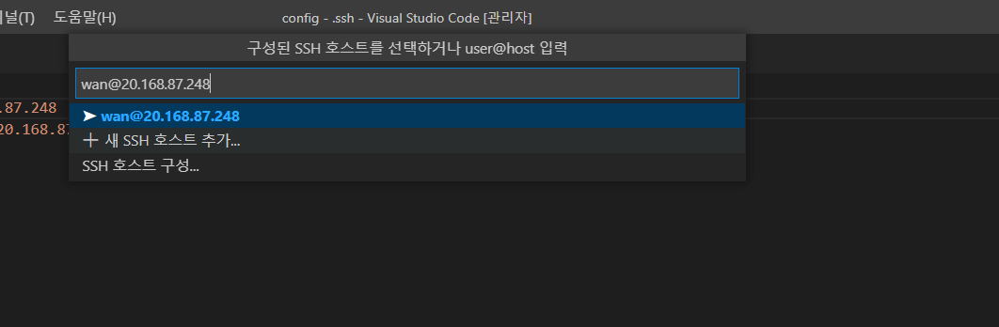
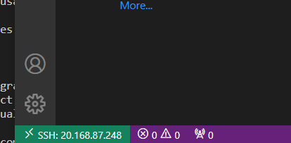
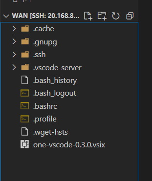

# ONE_VScode

## ONE_VScode 설치

### vscode에 SSH 확장 설치

https://code.visualstudio.com/docs/remote/ssh-tutorial

#### 1. Remotes-SSH Extension 설치

- 위 URL을 따라 extension에서 무리없이 설치할 수 있음

### 2. Virtual machine

#### 2-1. Azure

##### 1) Create a virtual machine 

- Azure 무료 가입

- 가상머신 생성

    - 이름 정해주기

    - 이미지 : ubuntu 18.04

    - **SSH 공개 키 설정**

        - 기존 퍼블릭 키 사용 선택 후 public key 발급받기

            ```bash
            ssh-keygen -m PEM -t rsa -b 4096
            ```

            ```bash
            Enter file in which to save the key (/c/Users/multicampus/.ssh/id_rsa): 
            ```

        - 생성된 경로로 이동 후 id_rsa.pub에 내용 복사 후 SSH 공개 키에 붙여넣기

    - 선택된 포트 사용 

    - 자동 종료 활성화 후 종료 

##### 2). connect ssh

- bash terminal에서 user@hostname로 접속 확인

    ```
    #ssh username@hostname
    ssh wan@20.168.87.248
    ```

- 원격 창 열고 

    - 호스트에 연결 클릭 
    - 
        - username@hostname 타이핑 후 엔터
    - 연결 성공
        - 

    

#### 2-2. Virtual Machine 

- ssh 접속 

    - https://lts0606.tistory.com/m/222

    - https://shanepark.tistory.com/195

    - https://jihyewoo.tistory.com/74

- VirtualBox로 리눅스 (Ubuntu18.04 설치)
    - https://sh-safer.tistory.com/132

### 4. ONE-vscode 확장 설치

- [one-vscode-0.3.0.vsix](https://github.com/Samsung/ONE-vscode/releases/download/0.3.0/one-vscode-0.3.0.vsix) 

    - 해당 파일 다운로드 

- 원격 탐색기에서 로컬에 폴더 연결

    - 드롭다운 방식으로 다운받은 파일 옮기기기

    

- 설치

    ```bash
    code --install-extension one-vscode-0.3.0.vsix
    ```

####  ONE VS-code 오류 해결

- 혜령님 글 참고 

- one vscode 설치 (extension 창에서 `…` 버튼 클릭해 [vsix로 설치] 선택)

    - vsix 파일을 Ubuntu에서 찾아 선택

    

- 아래와 비슷한 오류가 뜨면서 뭔가 잘 안 된다면, [파일] - [폴더 열기]를 해서 /home/user명/.vscode-server/extensions 경로의 samsung.one-vscode-0.3.0을 선택해보기

    
